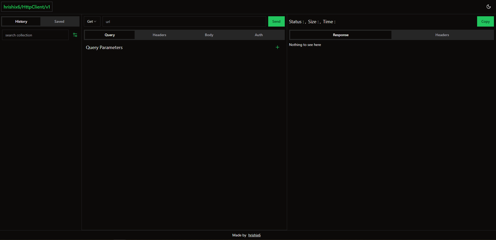

<h1 style="display:flex; align-items:center; gap:5px; justify-content:center;">
    
    <span style="display:block">HttpClient</span>
</h1>

<p style="text-align:center">chrome extension for API testing baked right into browser.</p>

## Built using

- [vite](https://vitejs.dev/)
- [react](https://react.dev/)
- [tailwindcss](https://tailwindcss.com/)
- [shadcn ui](https://ui.shadcn.com/)
- [prismjs](https://prismjs.com/)
- [beautifier.io](https://beautifier.io/)

## It's not fully functional yet, Working on following things

- request collections
- editable json/text/xml body
- Basic / Bearer authentication
- handle binary responses (file/img/blob etc)
- import/export collections
- generate code snippets for various languages for making request(eg, curl, node, C# etc)
- generate OpenAPI spec for collection
- add variables support to collection so user can set some defaults and then use them in requests.

## How to use

- clone this repository

- install `node >= 16.x.x`

- install dependencies

  ```bash
  $ npm install
  ```

- build
  ```bash
  $ npm run build
  ```
- open `dist` folder in chrome extensions using `Load unpacked` button (make sure you have developer mode on).

- <p style="display:flex; align-items:center; gap:3px;">
   <span style="display:block"> you should see an extension icon in toolbar, click the extension icon -> </span>
   
  </p>

- new tab should open with extension ui,
  <p>
    
  </p>

- exntension relies on `indexed db` to store data, make sure you have reasonably updated version of chrome.

## Contributions

- This is personal project that I am building just for fun and learning, not planning to publish.
- If you are still interested in contributing, pick up an issue and send PR.

## License

MIT
