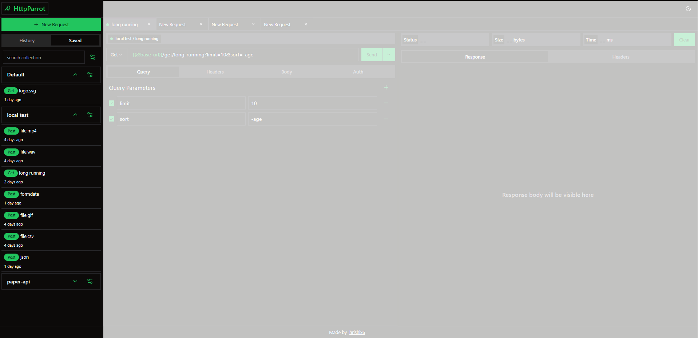

<h1 style="display:flex; align-items:center; gap:5px; justify-content:center;">
    
    <span style="display:block">HttpParrot</span>
</h1>

<p style="text-align:center">API testing tool baked right into chrome</p>

## Motivation

In light of the outrage surrounding my (ex) favourite API testing tool - Postman and many others e.g Kong's Insomnia, making controversial decisions about their product, I've decided to embark on the journey of rolling my own API client tool. I thought it would be a fun and challenging exercise. I will try
to replicate most essential features that such a tool should posses.

## Built using

- [vite](https://vitejs.dev/)
- [react](https://react.dev/)
- [tailwindcss](https://tailwindcss.com/)
- [shadcn ui](https://ui.shadcn.com/)
- [prismjs](https://prismjs.com/)
- [beautifier.io](https://beautifier.io/)
- [handlebars](https://handlebarsjs.com/)

## Features

- intuitive UI.
- Completely offline storage for saved requests/collections.
- sending request with any method, url.
- editable json/text/xml/formdata/urlencoded body
- formatted & highlighted text responses. (json, xml, html, js, css etc).
- show response metadata (response status, time, size).
- handle binary response (zip, audio, video, pdf, images).
- save request history to persist between sessions.
- save requests and group using collections.

## Todo

- Basic / Bearer authentication.
- import/export collections.
- generate code snippets for various languages for making request(eg, curl, node, C# etc).
- generate OpenAPI spec for collection.
- add variables support to collection so user can set some defaults and then use them in requests.

## Screeshots



## How to use

- clone this repository

- install `node >= 16.x.x`

- install dependencies

  ```bash
  $ npm install
  ```

- build
  ```bash
  $ npm run build
  ```
- open `dist` folder in chrome extensions using `Load unpacked` button (make sure you have developer mode on).

- <p style="display:flex; align-items:center; gap:3px;">
   <span style="display:block"> you should see an extension icon in toolbar, click the extension icon -> </span>
   
  </p>

- exntension relies on `indexed db` to store data , please use reasonably update browser.

## Contributions

I'm working on this as a personal project purely for the joy of learning, with no intentions of publishing it.
If you're still enthusiastic about contributing, feel free to select an issue and submit a pull request."

## License

MIT
